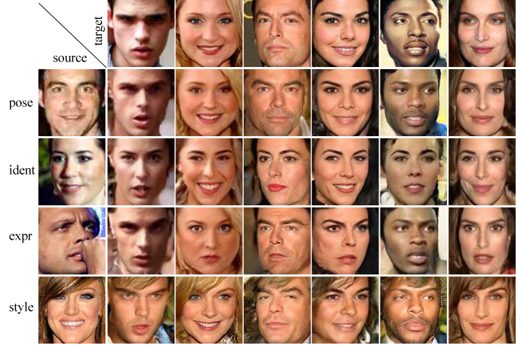

# Robust Discrimination and Generation of Faces using Compact, Disentangled Embeddings 
Björn Browatzki and Chistian Wallraven, [Cognitive Systems Lab](http://cogsys.korea.ac.kr/Cognitive_Systems.html), Korea University

This is the PyTorch implementation of the [ICCV RSLCV-2019](https://rsl-cv.univ-lr.fr/2019/) workshop paper "[Robust Discrimination and Generation of Faces using Compact, Disentangled Embeddings](http://openaccess.thecvf.com/content_ICCVW_2019/papers/RSL-CV/Browatzki_Robust_Discrimination_and_Generation_of_Faces_using_Compact_Disentangled_Embeddings_ICCVW_2019_paper.pdf)".<br>

 

### Adversarial Autoencoder for Multi-Attribute-Disentanglement (MAD)
*This method is based around two core ideas: first, our framework learns an unsupervised, low-dimensional embedding of faces using an adversarial autoencoder that is able to synthesize high-quality face images. Second, a supervised disentanglement splits the low-dimensional embedding vector into four sub-vectors, each of which contains separated information about one of four major face attributes (pose, identity, expression, and style) that can be used both for discriminative tasks and for manipulating all four attributes in an explicit manner. The resulting architecture achieves state-of-the-art image quality, good discrimination and face retrieval results on each of the four attributes, and supports various face editing tasks using a face representation of only 99 dimensions.*

- ### *The repository is still in preperation. Trained models and documentation will follow shortly.*


## Requirements

- Linux (not tested on other platforms)
- Python 3.6 or newer
- PyTorch >= 0.4.0
- CUDA >= 9.0
- cuDNN >= 7.1

## Getting started

### Install dependencies

You may want to setup a virtual environment for this project. See [virtualenv](https://virtualenv.pypa.io)
or [Anaconda](https://www.anaconda.com).

```
pip install -r requirements.txt
```

### Prepare datasets

For training you need:
- VGGFace2
- AffectNet
- VoxCeleb1

For testing you may need (depending on which evaluations you want to run):
- AffectNet
- LFW

### Edit dataset paths in config.py

Please change the paths in config.py according your dataset locations.


### Download trained models (optional)

Run `download_models.sh`. *[todo]*


## Test

### Reconstruct faces

### Generate random faces

### Edit faces

### Extract face embedding

### Performance evaluation on LFW

### Performance evaluation on AffectNet


## Training


### Training the Autoencoder

```
python train.py --sessionname [my_model]
```

### Training the Disentanglement (single)
```
python train.py --sessionname [my_model_dis] -r [my_model] --disent 1 --train_ae 0
```

### Training the Disentanglement (joint)
```
python train.py --sessionname [my_model_dis_joint] --r [my_model_dis] --disent 1 --train_ae 1
```


## Citation

If you find this project usefull, please cite the following paper:
```
@inproceedings{browatzki2019,
  title={Robust Discrimination and Generation of Faces using Compact, Disentangled Embeddings },
  author={Browatzki, Bjoern and Wallraven, Christian},
  booktitle={ICCV RSLCV},
  year={2019}
}
```


